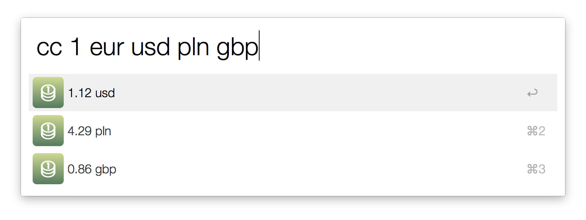

# Convert Currency

Alfred workflow and python3 script that converts currencies using [fixer.io](http://fixer.io) API.



## Usage

```
> python3 convert_currency.py 1 eur zł
4.2869 zł
```

You can pass argument that looks something like one of those examples:

* 10
* 10 gbp
* 10 gbp eur
* 10 gbp eur usd

You can set this two variables in *convertcurrency.py*:
```
DEFAULT_FROM_CURRENCY = 'EUR'
DEFAULT_TO_CURRENCIES = ('PLN', 'USD', 'EUR')
```
